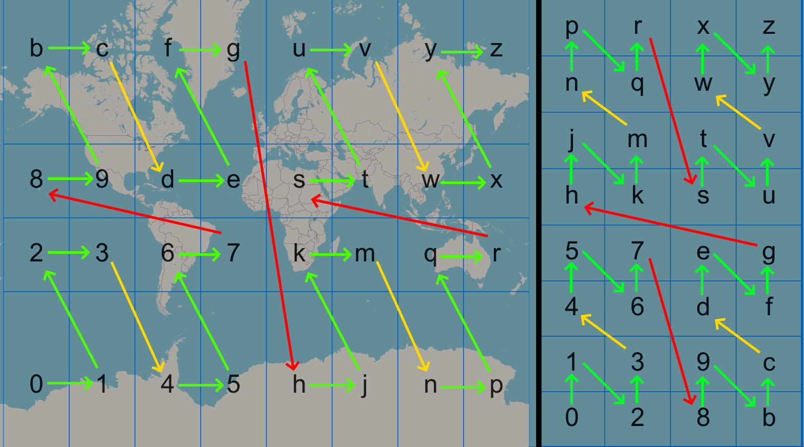

# Database Discussion - Partitioning

Fetching many regions is a big task, especially because DynamoDB was designed around single-item storage. The question is how to do it effectively.

**Note**: https://stackoverflow.com/questions/32917452/cheapest-way-of-getting-multiple-items-from-dynamodb, BatchGetItems is equal to running a GetItem call per item in price. Using a Query, dynamoDB charges for total data size instead of per item, which is likely ideal for our use case. For that, one has to sort items correctly under partition key "containers" and fetch them using a sort key range: https://docs.aws.amazon.com/amazondynamodb/latest/APIReference/API_Query.html . Query can search BETWEEN sort key values, bigger than, starts with, etc. This is a bit counter-intuitive, as that would mean we would need to lower the cardinality on our partition key, which goes against the AWS advice to go for highest cardinality - https://aws.amazon.com/blogs/database/choosing-the-right-dynamodb-partition-key/, but then again that doc also advocates having a good spread between partitions, so I suppose there needs to be a balance.

## Partition Key

AWS Blog on Using GeoHash in DynamoDB: https://aws.amazon.com/blogs/compute/implementing-geohashing-at-scale-in-serverless-web-applications/

The partition and sort key must allow for a Query that selects cells local to the position of the user's screen. Looking at https://geohash.softeng.co/gcpjfy6d, we can see that if a person's screen is on GCPJFY6D, then we have to fetch cells not only from the parent GCPJFY6, but also from the parent's parent at GCPJFY. If the user is between 4 regions, we may have to fetch them all, in this case gcpjfw, gcpjfy, gcpjft and gcpjfv. Each one of these 4 cells contains 32 cells that contain 32 cells = 4 * 32 * 32 = 4096 cells we would need to fetch. So we'll have to get:
gcpjfw00 to gcpjfwzz
gcpjfy00 to gcpjfyzz
gcpjft00 to gcpjftzz
gcpjfv00 to gcpjfvzz

Example of a range query, the user view is the outlined box in the middle:

More info: [map-chunking.md](map-chunking.md) 

**The partition key should contain:**

- App (2 symbols)
- Purpose (2 symbols) (e.g. Cell/Marker data)
- GeoHash prefix

## Sort Key

**The sort key should contain:**

- GeoHash suffix

## Summary

**CAUTION!** If shorter sort keys are stored in the same partition as longer ones, that may have a bad effect. For example, fetching w00 to wzz, w0 would also be returned. For that reason, sort keys are the same length within a partition. To help with comparison: https://dotnetfiddle.net/8TeZ7B

**CAUTION!** As we're using BETWEEN operator, it's very important to use only lowercase, as uppercase letters give different values in a string. 

| GH Length | Partition Key  | Sort Key | Max Partitions | Max Sort Keys | Sort Query                   | Parition Geohash Size |
| --------- | -------------- | -------- | -------------- | ------------- | ---------------------------- | --------------------- |
| **3**     | ShCe#          | gcp      | 1              | 32768         | **000** to **zzz**           | None                  |
| **4**     | ShCe#**g**     | cpj      | 32             | 32768         | P**000** to P**zzz**         | Continent             |
| **5**     | ShCe#**gc**    | pjf      | 1024           | 32768         | PP**000** to PP**zzz**       | Country               |
| **6**     | ShCe#**gcp**   | jfy      | 32768          | 32768         | PPP**000** to PPP**zzz**     | County                |
| **7**     | ShCe#**gcpj**  | fy6      | 1048576        | 32768         | PPPP**000** to PPPP**zzz**   | City                  |
| **8**     | ShCe#**gcpjf** | y6d      | 33554432       | 32768         | PPPPP**000** to PPPPP**zzz** | Village               |

Why a sort key length 3? Because, when looking at the geohash map (https://geohash.softeng.co/gcpjfy6d, [database-usage-query.md](database-usage-query.md)), it's evident that given a landscape user view, at any zoom level, at any time a range query of no more than 3 geohash characters is needed to fetch all related related data (e.g. data small enough to build a heatmap).

Seems like grids alternate between BCFGUVYZ (odd length) and PRXZ (even length) arrangement. Regardless of that, the arrangement is still the same, just flipped, so as long as one knows the letters to fetch, one can build a range query following this diagram:

