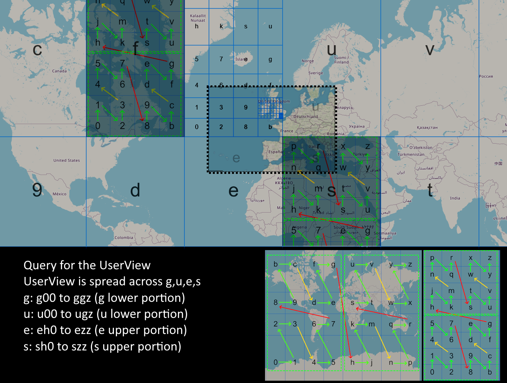

# Database Usage - Query

Using the established patterns in [database-discussion-partitioning.md](database-discussion-partitioning.md), we can use range queries to fetch data in an inexpensive and efficient manner. The query can get up to 1 MB of data (more if paginated), and from what I understand is counted as a single read in terms of cost, where only the total size of the items is important. Supposedly much cheaper due to the fact that it uses a Sort range and doesn't have to lookup individual items but can grab a whole bunch.

Overall, DynamoDb's Query is better in our case than GetItem or GetBulkItem, as it retrieves N amount of records, paginated, and also can likely deal better with missing items, which our database will have, so we can save on bandwidth and requests.

## Visual Example

We can see in the above example that the biggest query ranges involve no more than 3 depths of the GeoHash sort key. As such, it's fitting that the Sort Key only spans 3 depths.
